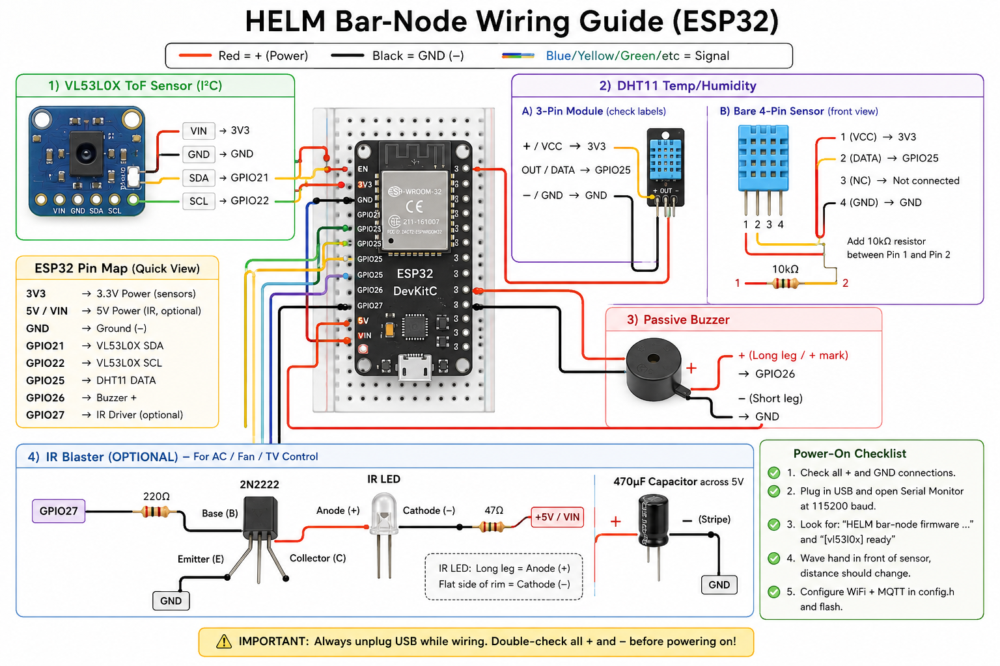

# HELM Bar-Node Firmware (ESP32)

Arduino sketch for the HELM **bar node**: it reads the VL53L0X to detect reps and
hang time, reads a DHT11 for room temperature and humidity, drives a passive buzzer,
**blasts IR to control an AC / fan / TV**, and streams everything to the server over
MQTT. The detection logic mirrors `web/src/lib/detection.ts` exactly, so the
TypeScript unit tests also validate the on-device algorithm.

## Hardware

New to wiring? See **[HARDWARE.md](HARDWARE.md)** for the beginner, pin-by-pin
guide. The full diagram:



| Part           | Pin → ESP32 |
|----------------|-------------|
| VL53L0X VIN    | 3V3         |
| VL53L0X GND    | GND         |
| VL53L0X SDA    | GPIO21      |
| VL53L0X SCL    | GPIO22      |
| DHT11 VCC      | 3V3         |
| DHT11 GND      | GND         |
| DHT11 DATA     | GPIO25 (10k pull-up to 3V3 if bare) |
| Buzzer +       | GPIO26 (passive piezo) |
| Buzzer −       | GND         |
| IR LED driver  | GPIO27      |
| IR receiver OUT| GPIO14 (optional — VS1838B, VCC→3V3, GND→GND) |

### IR blaster wiring (2N2222 + IR LEDs + 470µF)

The ESP32 can't drive a bright IR LED string directly, so a transistor switches it:

```
GPIO27 ──[220Ω]──► 2N2222 base
5V ──► IR LED(s) ──[current-limit R]──► 2N2222 collector
2N2222 emitter ──► GND
470µF electrolytic across the 5V/GND LED supply (buffers the pulse current)
```

- Put the LEDs on the **5V** rail (VIN/5V pin), not 3V3 — more range.
- Size the current-limit resistor for your LED count (e.g. ~22–47Ω for one or two
  LEDs at 5V); a single 470µF cap across the supply smooths the burst draw.
- Point the IR LEDs at the AC / fan you want to control (line-of-sight).

### IR receiver (optional — learn mode)

To capture a code straight off an existing remote instead of typing hex, add a
3-pin **VS1838B** / TSOP38238 (looks like a small black LED) on **GPIO14**:

```
Dome (lens) toward you, legs down, left → right:
  OUT (left) → GPIO14 | GND (middle) → GND | VCC (right) → 3V3   (NOT 5V)
```

No resistor/transistor needed. Bare parts have **no labels** — the order is by
position and **swapping VCC/GND can destroy it**, so confirm against the
datasheet. The receiver's ISR is only enabled during a console-initiated "learn"
window (auto-stops ~20s), so it never disturbs rep detection. Drive it from the
web **Remote** page → Edit → Add → *Learn from remote*.

Mount the VL53L0X on the wall **10 cm above the bar**, centered, pointing
**outward** toward your body. When you hang, your head reads far/low in the beam;
at the top of a pull-up your head rises close to the sensor.

## Software setup

1. Install the **ESP32 board package** in the Arduino IDE
   (Boards Manager → "esp32" by Espressif, 2.0.2+).
2. Install these libraries (Library Manager):
   - **Adafruit VL53L0X**
   - **PubSubClient** (Nick O'Leary)
   - **ArduinoJson** (v7.x)
   - **DHT sensor library** (Adafruit) + **Adafruit Unified Sensor**
   - **IRremoteESP8266** (crankyoldgit — works on ESP32; drives the IR blaster)
3. In `firmware/helm/`, copy `config.example.h` → `config.h` and fill in your
   WiFi + MQTT details. `config.h` is gitignored.
4. Open `helm.ino`, select your ESP32 board + port, and upload.
5. Open Serial Monitor at **115200 baud** to watch it connect and detect reps.

## Faster: build & flash from the CLI (no IDE)

The Arduino IDE rebuilds everything on every compile and is sluggish. Use
[`arduino-cli`](https://arduino.github.io/arduino-cli/) instead — it's headless
and **caches compilation**, so incremental builds take seconds. The
[`flash.sh`](flash.sh) wrapper does build, USB-flash, and one-command OTA:

```bash
# one-time: install arduino-cli, then the ESP32 core + all libraries
curl -fsSL https://raw.githubusercontent.com/arduino/arduino-cli/master/install.sh | sh
firmware/flash.sh setup

# copy the config template and set HELM_URL + HELM_PASSWORD (+ PORT for USB)
cp firmware/build.env.example firmware/build.env   # gitignored

firmware/flash.sh            # compile + export build/helm.ino.bin
firmware/flash.sh usb        # compile + flash over USB serial
firmware/flash.sh ota        # compile + upload to the console + trigger OTA — no browser
```

`ota` mode replaces the whole *Export Compiled Binary → upload in the web UI →
Push* dance: it logs in, uploads `build/helm.ino.bin`, and triggers the push via
the console's API. The `min_spiffs` partition (required for OTA) is baked into the
default `FQBN`. Close any serial monitor before a USB flash — a held port makes
the ESP32 "stop responding" mid-write.

## How it behaves

- Publishes raw distance continuously to `pullup/<DEVICE_ID>/telemetry`
  (for the live gauge + calibration).
- Publishes `session_start`, `rep`, and `session_end` events to
  `pullup/<DEVICE_ID>/event`.
- Publishes temperature and humidity every 60 s to `pullup/<DEVICE_ID>/env`
  (sampled only when idle so the DHT read never stalls a rep).
- Publishes retained status to `pullup/<DEVICE_ID>/status` every ~15 s —
  online flag, firmware version, Wi-Fi RSSI, uptime, free heap and IP — which
  drives the web **Device** health panel. Offline is delivered by the MQTT
  Last-Will if the device drops.
- Subscribes to the retained `pullup/<DEVICE_ID>/config` topic; whenever you
  change thresholds or the buzzer toggles in the web **Settings** page, the new
  values arrive instantly — **no reflashing needed**.
- Chirps the buzzer on each counted rep and plays a two-tone jingle on session
  end, both gated by the Settings sound toggles.
- Subscribes to `pullup/<DEVICE_ID>/ir/cmd` and transmits the IR frame — a
  Panasonic AC state frame (`{"t":"climate",…}`) or a generic protocol code
  (`{"t":"button","protocol":"NEC","code":"00CF8976","bits":32}`). Commands are
  queued and transmitted right away in any state, so the fan/AC responds
  instantly even while the bar sensor sees something (an IR burst only pauses
  distance sampling for a few tens of ms).
  It acks each send on `pullup/<DEVICE_ID>/ir/ack`. Devices/buttons are managed
  on the web **Remote** page; nothing is hard-coded in firmware.
- Subscribes to `pullup/<DEVICE_ID>/ir/learn` (`{"on":true,"ms":20000}`) for the
  optional IR **receiver**: it enables the RX for that window and publishes each
  decoded frame (`{"protocol":"NEC","code":"20DF10EF","bits":32}`) on
  `pullup/<DEVICE_ID>/ir/learned`, which the Remote page's *Learn from remote*
  button uses to auto-fill a captured button.
- Subscribes to `pullup/<DEVICE_ID>/ota` for **over-the-air firmware updates**
  (see below) and reports progress on `pullup/<DEVICE_ID>/ota/status`.

## Over-the-air (OTA) updates

After the first USB flash you can update the firmware wirelessly from the web
console — no cable:

1. In the Arduino IDE, **Sketch → Export Compiled Binary**. This writes
   `helm.ino.bin` next to the sketch (in `build/…/`).
2. In the web app open **System → Device**, upload that `.bin`, and hit **Push**.
3. The console publishes the image URL + MD5 on `pullup/<DEVICE_ID>/ota`; the
   device downloads it straight from the app over HTTP(S), verifies the MD5,
   flashes the idle OTA partition, and reboots into it. Progress streams back to
   the panel; on reboot the new version shows under **Firmware**.

Notes:
- The OTA code uses `HTTPClient`, `Update` and `WiFiClientSecure`, all part of
  the ESP32 core — **no extra libraries** to install.
- Use a partition scheme with two app slots (the default *"Default 4MB with
  spiffs"* has `ota_0`/`ota_1`, so OTA works out of the box). **Tools → Partition
  Scheme** in the IDE.
- A bad or interrupted download aborts cleanly and keeps the running firmware;
  the error surfaces on the Device panel.

## Calibration

Open the web app's **Settings** page (it shows the live distance reading) and:

1. Hang from the bar — note the resting distance.
2. Pull up to chin-over-bar — note the distance at the top.
3. Set **Rep line** just above the chin-over-bar reading so a full rep clearly
   crosses it, but a partial rep doesn't.
4. Set **Presence range** below your resting-standing distance so the session
   only starts when you're actually hanging.

Changes save straight to the device over MQTT.
